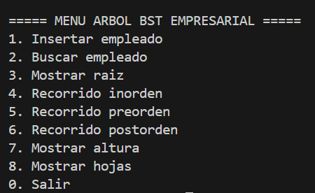
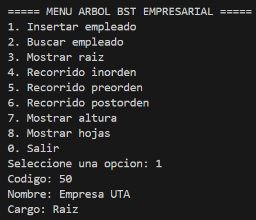
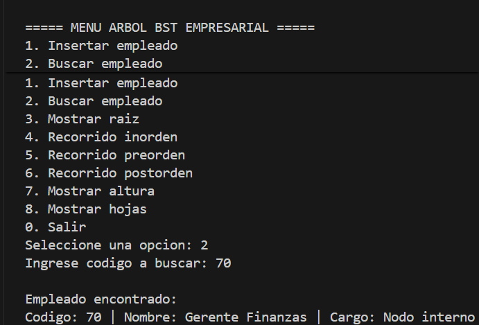
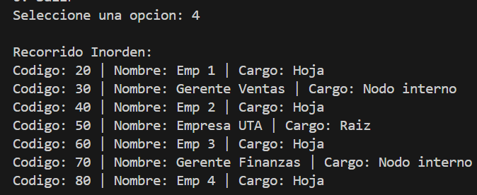
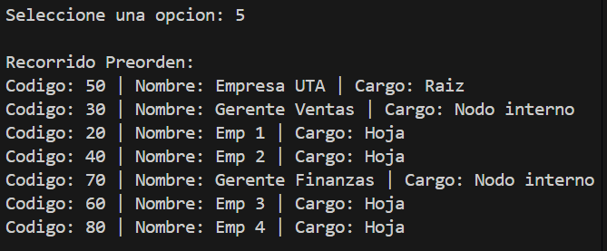
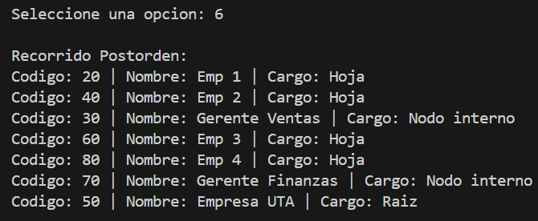
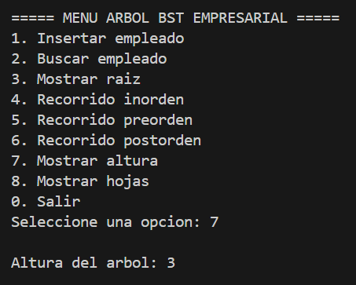
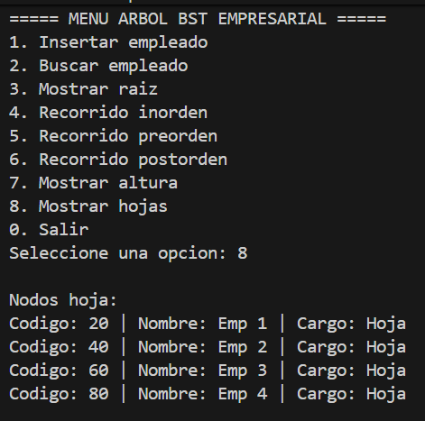

# Árbol BST Empresarial en C++

**Asignatura:** Estructura de Datos  
**Institución:** Universidad Técnica de Ambato (UTA)  
**Estudiante:** Jonathan Valle

## Objetivo
Implementar un árbol binario de búsqueda (BST) en C++ para organizar a los empleados de una empresa utilizando un código numérico como clave, permitiendo una gestión jerárquica eficiente.

## Funcionalidades
- Inserción de empleados.
- Búsqueda de empleados por código.
- Visualización de la raíz del árbol.
- Recorridos: Inorden, Preorden y Postorden.
- Cálculo de la altura del árbol.
- Identificación de los nodos hoja.

## Conceptos Teóricos del Árbol
Para cumplir con los requisitos de la guía, se definen los siguientes conceptos aplicados:
* **Raíz:** Es el nodo superior.En nuestras pruebas, es el nodo con código **50**.
* **Nodo Interno:** Nodos con al menos un hijo, como los códigos **30** y **70**.
* **Hoja:** Nodos sin hijos, situados al final de las ramas (ej. códigos 20, 40, 60, 80).
* **Nivel:** La distancia de un nodo a la raíz.
* **Altura:** La profundidad máxima del árbol.

## Capturas de Ejecución

### 1. Menú Principal e Inserción

### 2. Búsqueda de Empleado

### 3. Recorridos (Inorden, Preorden, Postorden)

### 4. Altura y Nodos Hoja

## Conclusión
El Árbol Binario de Búsqueda facilita la organización jerárquica y optimiza los tiempos de búsqueda en comparación con estructuras lineales, siendo ideal para organigramas empresariales.

### 4. Altura y Nodos Hoja

## Conclusión
El Árbol Binario de Búsqueda facilita la organización jerárquica y optimiza los tiempos de búsqueda en comparación con estructuras lineales, siendo ideal para organigramas empresariales.
